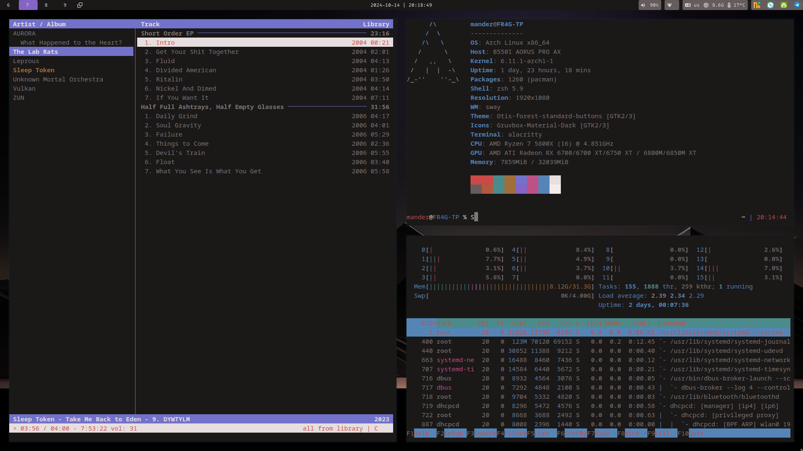

## Mandots

These are my dots for my current setup. I use a lot of standard configs, this is mainly for my own sake and backup. If you wish to use, go ahead, but do know that my setup is very much mander specific. Main edits are the ones regarding the sway/i3 keyboard shortcuts. Everything is vim styled, or that is what I am attempting to accomplish.

Also, *if you are using these dots, beware that I am not good at this, and if something breaks, for the love of god, create an issue here before complaining to the authors of the tools*

### Information about my systems
I got three systems with two completely different themes, you can find each setup for each branch.

- FR4G-TP is my tiny monster, it is my first ever PC build, got AMD Ryzen 7 5800X, AMD Radeon RX 6700X and got 32 GB of ram.
- CL4P-TP is a Lenovo ThinkPad T495 with the Ryzen 7 configuration.
- 3g0-tp is a dell xps 13

Since you are in the FR4G-TP repo, here is a screenshot:

Currently the main repo is my repo for FR4G-TP since it is the rice I am working on, if you rather have my gruvbox rice, then you want the CL4P-TP branch. 

### Applying the dots 
To add dots, which if you're not mander, I do not quite get why you would want to, but you may, as long as you let people know where you got them, go ahead and use. Everything is managed by stow, so run the following:

``stow [a-z]*``

Alternatively, if you wish to only use a few of the tools I use, you can do:

``stow <config file name>``

Example:

``stow zsh nvim``

Will only apply the zsh and nvim configuration

### Note for wayland
This is ~~completely~~ partially untested and a work in progress. Most things are currently in working condition, however, some things still have addtional configuration/things I want to do whenever I have time for it...

### To-do:
- [ ] More eww, making a sidebar for FR4G rather than my previous top bar, got a concept in mind and started a yuck config but this will take a whiiiiileee.
~~- [ ] Migrate eww to yuck branch~~
- [ ] Fix phocus with correct color scheme
~~- [ ] Create GTK theme with gruvbox hard contrast rather than the regular soft one that is being used right now~~
- [ ] anything else that might come to mind for me 
- [ ] Set up all the color schemes
- [ ] Change up rofi to become more floaty like everything else in this rice (need to come up with concept tho)

### On-Pause:
- [ ] ~~Create installation script~~ Fixed stow management with simple shell command, TODO: create a script that installs all necessary software, including compiling eww (this is on pause atm due to FR4G not having all of the shit it needs.)
- [ ] Finish writing and setting up [remander](https://github.com/manderio/remande.rs) with eww
- [ ] Create installation script for nvim
- [ ] Add credits for all vim plugins
- [ ] Add Kyria stuff
- [ ] Eww part 2 (the welcome screen/splash screen project), on pause until new eww config format is done and I feel more confident with eww as a whole

### Done:
- [x] Update the screenshots for my system
- [x] Fix alias for everything making it all nice and neat
- [x] Update nvim config (although partially done, went back to vim script, sorry elko)
- [x] Customize rofi, make it more gruvbox
- [x] Customize ~~polybar~~ eww, make my own version of it
- [x] Work on my ~~termite fork~~ alacritty config to set up the keyboard shortcuts better
- [x] Fix zsh config

### Dependencies
- Nvim config uses [coc](https://github.com/neoclide/coc.nvim) meaning you need to use nodejs in order for it to work. 
- Will add more dependencies as stuff breaks without me noticing

### Section where I can spend time praising other lovely human beings
Because in this community we all need to show some love to people/tools that are amazing. Give them a hug and thank them for contributing with great things!

### Tools I use in Wayland
- [sway](https://swaywm.org/), the wayland version of i3
- [alacritty](https://github.com/alacritty/alacritty), replacement for termite since it got obsoleted
- [mako](https://github.com/emersion/mako), notification daemon, replacement for dunst
- [waybar](https://github.com/Alexays/Waybar), wayland bar that is highly customiziable
- [stow](https://www.gnu.org/software/stow/), symlink farm manager for my dotfiles
- [rofi](https://github.com/davatorium/rofi), a manager that i use along with [dmenu](https://tools.suckless.org/dmenu/)
- [nvim](https://github.com/neovim/neovim), what happens if you improve vi twice? this. this is what happens. It's great!
- [zsh](https://www.zsh.org/), my shell that I use
- [phocus](https://github.com/phocus/gtk/), the gtk theme tool I am using

### Credit to people who are more talented than me
Note that while I no longer use some of these, I will still always appreciate and credit the people helping me out below! Open source is best spread by the word of mouth!
- Vim used to be ~~mainly~~all configured ~~with the help of~~ by [Elkowar](https://github.com/elkowar), he's also been a huge help for everything eww related and patiently standing my feedback, as well as my "I BROKE EWW AGAIN :D", so please give him a hug from me and contribewwt
- Gruvbox, the superior color scheme, can be found [here](https://github.com/morhetz/gruvbox)
- Rofi was using the standard sidebar theme, can be found in the original package linked above, in the new dots I've switched out the colors and made it a bit more gruvbox to fit my overall theme
- Also, just give an extra hug to [buffet](https://github.com/buffet), he's helped me out a ton and had to listen to me struggle with everything wayland related
- Back when I used polybar I would use a modified version of [this one](https://github.com/adi1090x/polybar-themes#forest) made by adi1090x, if that doesn't float your boat I am sure you can find something you like there
- Will link source for my wallpaper here once I find it! Currently I am using a modified version of a modified version I found on the r/UP discord, so yea...
- Before I made my own scheme and started using phocus, I am using a GTK gruvbox theme I found [here](https://github.com/sainnhe/gruvbox-material-gtk), will make a hard contrast version, but until then, please show Sainhe some love thank you!
- Latest addition to my useful neat tools is [phocus](https://github.com/phocus), it is very modular, highly epic and created by [best boomer](https://github.com/phisch)

### Tools I used when I was on x, or that I have used in the past
might be viable alternatives for someone looking for a similar wm
- [i3-gaps](https://github.com/Airblader/i3), a fork of [i3](https://i3wm.org/) that adds gaps to the config
- [termite](https://github.com/thestinger/termite), a terminal with keybind support, yay! less mouse usage!
- [autorandr](https://github.com/phillipberndt/autorandr), lifesaver if you are using multiple monitors for i3
- [dunst](https://github.com/dunst-project/dunst), notification dameon, my config is broken, but the tool is lovely
- [tbsm](https://github.com/loh-tar/tbsm), a login manager that allows you to log in straight from the terminal! 
- [oh-my-zsh](https://github.com/ohmyzsh/ohmyzsh), a shell set up before i wasn't too lazy to do it myself, didn't like the presets so removed it, that's me though
- [eww](https://github.com/elkowar/eww), Elkowar's wacky widgets, using the bar functionality as a replacement for polybar

Note that the configs won't magically translate to my x tools, I just want to give credit to people who are cooler than I will ever be! If you wanna adapt, I won't stop you lol
